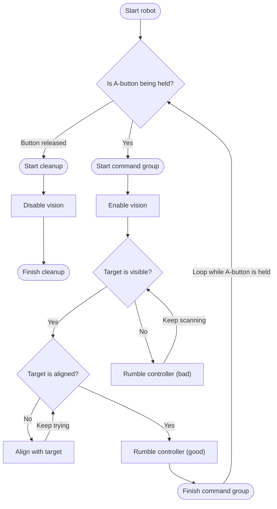

# Vision command groups

Command groups that make use of computer vision.

<!-- Generate README.md with this command: mmdc -i README.template.md -o README.md -->

## Upper hub alignment

```mermaid
graph TB
  robot.start([Start robot])
  command.start([Start command group])
  command.finish([Finish command group])
  cleanup.start([Start cleanup])
  cleanup.finish([Finish cleanup])

  buttons.a{Is A-button being held?}

  vision.enable[Enable vision]
  vision.disable[Disable vision]
  vision.align[Align with target]

  vision.hasTarget{Target is visible?}
  vision.isAligned{Target is aligned?}

  controller.rumble.bad["Rumble controller (bad)"]
  controller.rumble.good["Rumble controller (good)"]

  robot.start --> buttons.a

  buttons.a -- Yes --> command.start
  buttons.a -- Button released --> cleanup.start

  cleanup.start --> vision.disable --> cleanup.finish

  command.start --> vision.enable --> vision.hasTarget

  vision.hasTarget -- No --> controller.rumble.bad -- Keep scanning --> vision.hasTarget
  vision.hasTarget -- Yes --> vision.isAligned

  vision.isAligned -- No --> vision.align -- Keep trying --> vision.isAligned
  vision.isAligned -- Yes --> controller.rumble.good --> command.finish

  command.finish -- Loop while A-button is held --> buttons.a
```
